# Bottleneck MAE: $\ \text{Image} \rightarrow \mathbb{R}^{1024} \rightarrow \hat{\text{Image}}$

Vision foundation models such as [Masked Autoencoders (MAE)](https://arxiv.org/abs/2111.06377), DINO series ([DINO](https://arxiv.org/abs/2104.14294), [DINOv2](https://arxiv.org/abs/2304.07193), [DINOv3](https://arxiv.org/abs/2508.10104)) aim to extract generalizable image features that can be used for a wide range of downstream tasks.

However, ViT based models produce large feature tensors of shape $B \times N \times D$, where $N$ is the number of patches and $D$ the feature dimension. For tasks with a temporal dimension, sequences of images would have shape $B \times T \times N \times D$, making the latent space too large to compute efficiently.

In addition, DINO models lack a decoder head to reconstruct images from features. For tasks that generate new features (e.g., world models rollout in image features), it may be useful to decode them back to image space for visualization, but the DINO series does not support this.

<!-- 
Some downstream models also work in the image feature space, for example a world model that rolls out directly in image features. In those cases, it is useful to reconstruct the rollout sequence back to pixel space for visualization. Many world model tasks also bring in a temporal dimension since they predict the next frame in a sequence. In this setting, raw ViT outputs are a bit awkward because they have shape $B \times L \times D$, where $L$ is the number of patches. Stacking an extra time dimension on top of that makes the representation heavy and difficult to work with. -->

Thus, we finetune a pretrained MAE adapted from [the official implementation](https://github.com/facebookresearch/mae). We add a bottleneck layer after the encoder and use a DETR-style reconstruction layer so that the encoder maps each image to a 1024-dimensional feature vector, while the decoder reconstructs the original image.

## Related Works
This project was originally developed in [REMI](https://arxiv.org/abs/2507.02064). The paper developed an ANN model of the rat brain during spatial navigation tasks. The goal is to visualize how the model virtually explores the environment during planning. 

In neuroscience setting, the paper is about a system-level computational model of hippocampal and entorhinal cortex cells of how they build spatial maps. In the machine learning setting, it presented a brain-inspired world model similar to [Dreamer](https://arxiv.org/abs/2301.04104), using a bottleneck MAE to extract image features and visualize imagined navigation during planning.

## Example
See `examples/demo.ipynb` for an example of how to use the BtnkMAE model.
### Compress and reconstruct images from ImageNet-1k (224x224)
<table style="border-collapse: collapse; border: none; width: 100%;">
  <tr>
    <td></td>
    <td></td>
    <td></td>
    <td></td>
    <td></td>
    <td></td>
  </tr>
  <tr>
    <td></td>
    <td></td>
    <td>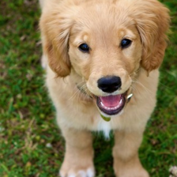</td>
    <td>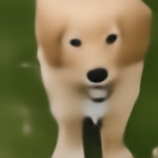</td>
    <td>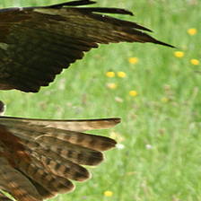</td>
    <td></td>
  </tr>
  <tr>
    <td></td>
    <td>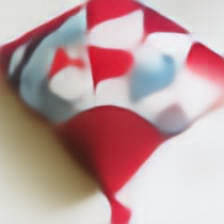</td>
    <td>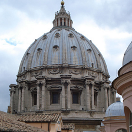</td>
    <td></td>
    <td>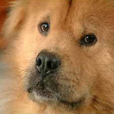</td>
    <td>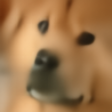</td>
  </tr>
</table>

### Processing Panorama Images
The model can also handle images of varying sizes. For instance, to process images of size 1024×512, we first resize them to 512×512. We then fine-tune the model pretraiend on 224×224 images on the 512x512 images by recomputing the cos-sin positional embeddings.

The following results are obtained by fine-tuning the model on panorama images of a single scene in [Habitat-Sim](https://github.com/facebookresearch/habitat-sim)as part of the [REMI](https://arxiv.org/abs/2507.02064) paper, where the bottleneck MAE was originally developed for.
<table style="border-collapse: collapse; border: none; width: 80%; margin: 0 auto;">
  <tr>
    <td>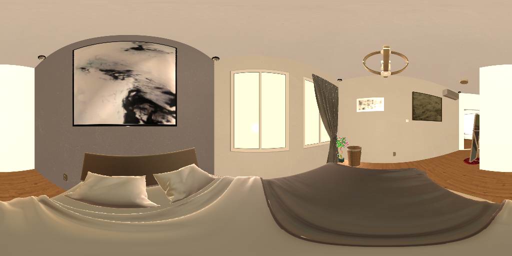</td>
    <td>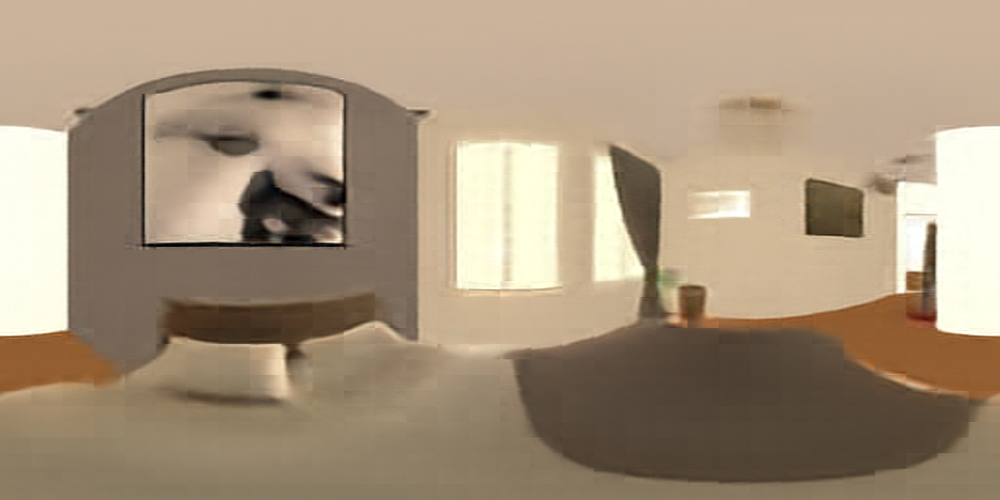</td>
  </tr>
  <tr>
    <td>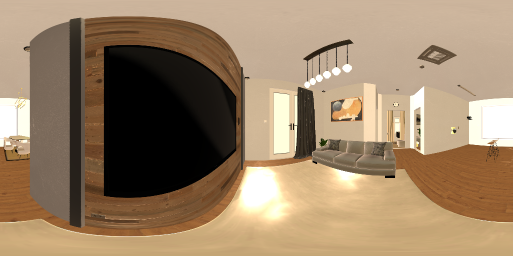</td>
    <td>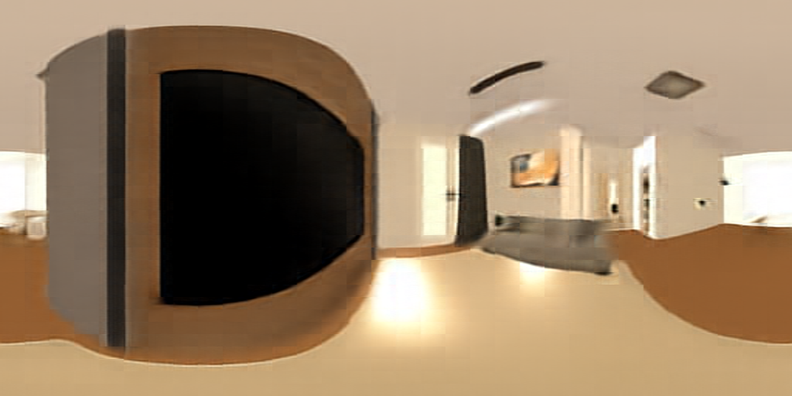</td>
  </tr>
  <tr>
    <td>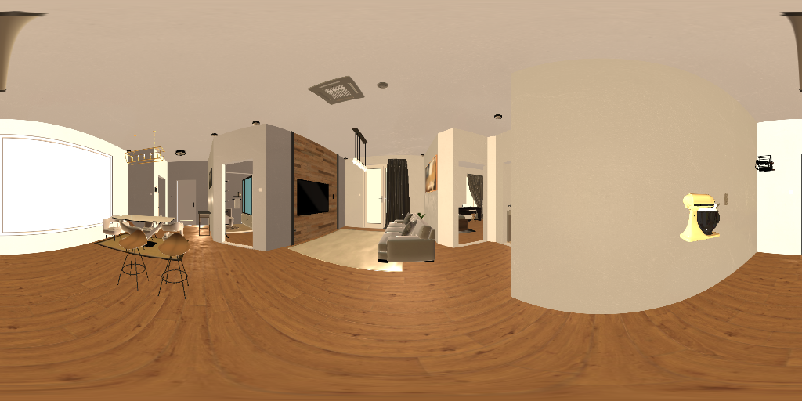</td>
    <td>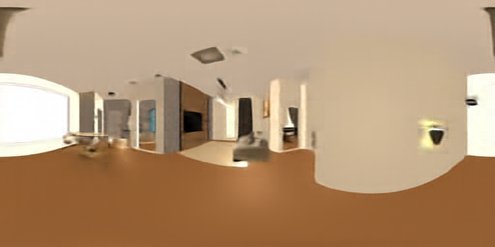</td>
  </tr>
</table>

## Environment
### Clone the repository
```bash
git clone https://github.com/grasp-lyrl/btnk_mae.git
cd btnk_mae
```

### Install the dependencies
```bash
python3.10 -m venv .venv
source .venv/bin/activate
pip install --upgrade pip
pip install -r requirements.txt
```

### Install PyTorch
We recommend installing PyTorch with their [official instructions](https://pytorch.org/get-started/locally/), as the RTX 50 series is currently supported only by the nightly builds.

## Datasets
### Tiny ImageNet
For local testing of the training scripts, the Tiny ImageNet dataset could be helpful. The dataset can be downloaded from the [CS231n website](http://cs231n.stanford.edu/tiny-imagenet-200.zip). The following commands will download and unzip the dataset to `<project_root>/data/`.
```bash
cd <project_root>
mkdir data
wget http://cs231n.stanford.edu/tiny-imagenet-200.zip
unzip tiny-imagenet-200.zip -d data/ 
rm tiny-imagenet-200.zip
```
Set the `data.dataset` variable in the `configs/config.yaml` to "tiny-imagenet-200" to use the dataset.

### ImageNet-1k
Set the `data.dataset` variable in the `configs/config.yaml` to "imagenet-1k" to use the dataset.

The huggingface cli will automatically handle the dataset download and split. The dataset is approximately 140GB. And one may need to login the huggingface cli (see [here](https://huggingface.co/docs/huggingface_hub/en/guides/cli#huggingface-cli-login)) to download the dataset.

#### Using HuggingFace CLI
```bash
huggingface-cli login
```
Then follow the prompt to enter the access token.

### Custom dataset
To use a custom dataset, simply set the `data.dataset` variable in the `configs/config.yaml` to the **absolute path** of the dataset. For any other dataset, modify the `dataset.py` file to include it accordingly.

The current implementation of the custom dataset requires a `dataset_config.json` file in the dataset directory to enforce a controllable dataset loading behavior. You may modify the `btnk_mae/utils/datasets.py` file to remove this requirement. Example of the `dataset_config.json` file:
```json
{
    "dataset_name": "your_dataset_name",
    "dataset_type": "panorama",
    "dataset_path": "path/to/your/dataset"
}
```

The `dataset_type` can be `panorama` or `custom`. This setting is primarily used to determine if the images in the dataset require special handling (such as resizing to panorama images to 512x512).

## Training
### Train the model
NOTE: We use the terms *train* and *finetune* with respect to the bottleneck structure added on top of the pretrained MAE. In both cases, we always start by loading the pretrained weights from the original MAE paper. By *training*, we mean loading the parts of the structure that overlap with the original MAE and then training on ImageNet-1k until the bottleneck layers are also trained. By *finetuning*, we mean starting from the trained model and further tuning it to let it “overfit” to a domain specific dataset.

#### Enable Hydra Full Error
Highly recommended to enable this when debugging.
```bash
export HYDRA_FULL_ERROR=1
```
#### Single GPU
If the run name is not provided, it will set to an auto-generate datetime string.
```bash
CUDA_VISIBLE_DEVICES=<GPU_IDS> python train.py --config-name=<train/finetune> run_name=<RUN_NAME> [any Hydra overrides…]
```
Example:
```bash
CUDA_VISIBLE_DEVICES=0 python train.py --config-name=train run_name=btnk_mae
```
#### Multi GPU
Two GPUs with DDP
```bash
torchrun --nproc_per_node=<NUM_GPUS> train.py --config-name=<train/finetune> run_name=<RUN_NAME> [any Hydra overrides…]
```
Example:
```bash
torchrun --nproc_per_node=8 train.py --config-name=train
```

#### Overwrite config with hydra
```bash
./scripts/train.sh 0 custom_run_name \
    train.batch_size=64 \
    epochs=50 \
    optimizer.lr=5e-4
```

## Monitoring
This project uses [Weights & Biases](https://wandb.ai/) (wandb) for experiment tracking and visualization.

To use wandb:
1. Make sure you have a wandb account
2. Login to wandb in your terminal: `wandb login`
3. Run training with the following parameters:
   - `--wandb_project`: Project name (default: "btnk_mae")
   - `--wandb_entity`: Your wandb username or team name (optional)
   - `--wandb_run_name`: Custom name for this run (optional)

### Disable wandb
You can decide whether to use wandb or not by toggling the `WANDB_MODE` environment variable.
```bash
export WANDB_MODE=disabled  # Disable wandb
export WANDB_MODE=online    # Enable wandb
```

## Citation
If you found this project useful, please cite the paper:
```bibtex 
@inproceedings{WangREMI2025,
   title = {REMI: REconstructing Memory During Intrinsic Path Planning},
   author = {Wang, Zhaoze and Morris, Genela and Derdikman, Dori and Chaudhari, Pratik and Balasubramanian, Vijay},
   booktitle = {Advances in Neural Information Processing Systems (NeurIPS)},
   year = {2025},
   url = {https://arxiv.org/abs/2507.02064},
   eprint = {arXiv:2507.02064}
}
```
Since this project is based on the Masked AutoEncoder (MAE) model, please also cite:
```bibtex
@Article{MaskedAutoencoders2021,
  author  = {Kaiming He and Xinlei Chen and Saining Xie and Yanghao Li and Piotr Doll{\'a}r and Ross Girshick},
  journal = {arXiv:2111.06377},
  title   = {Masked Autoencoders Are Scalable Vision Learners},
  year    = {2021},
}
```

## License
This project is licensed under the MIT License - see the [LICENSE](LICENSE) file for details.
